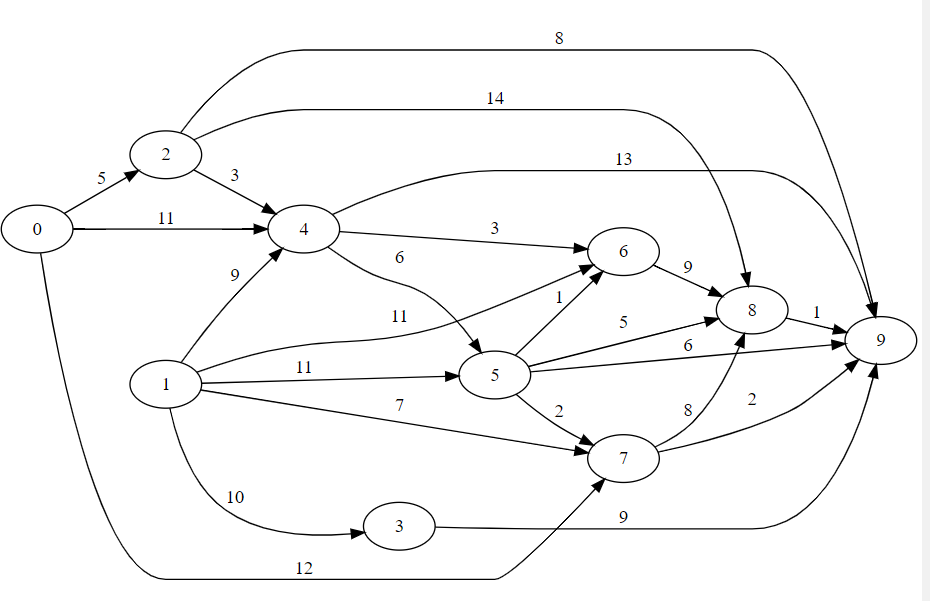

<!-- omit in toc -->
# Projet 2 d'algorithmique
<!-- omit in toc -->
## Auteurs

- Jocelyn Caron
- François Soulié

<!-- omit in toc -->
## Table des matières

- [Exercice 1](#exercice-1)
  - [Fonction CalculerMA](#fonction-calculerma)
  - [Fonction symetrique](#fonction-symetrique)
  - [Fonction acm](#fonction-acm)
  - [Fonction coutArc](#fonction-coutarc)
- [Exercice 2](#exercice-2)
  - [Fonction coutMin_et_argCoutMin](#fonction-coutmin_et_argcoutmin)
  - [Fonction coutParMinimisationLocale](#fonction-coutparminimisationlocale)
- [Résultat](#résultat)

<div style="page-break-after: always;"></div>

## Exercice 1

### Fonction CalculerMA
>`m(j)` : Coût minimum d'un chemin allant du sommet `0` au sommet `j`.

>`c(u,v)` : Coût de l'arc allant du sommet `u` au sommet `v`.

$$
m(j) =
  min_{v\in P(j)}( m(v) + c(v,j) ),\space
  P(j) \space\text{l'ensemble des sommets connectés à j}
$$

On procède par relachement d'un contrainte sur l'ensemble des prédécésseurs du sommet `j`, une technique abordée lors des premiers TDs de programmation dynamique.

```java
static int[][] calculerMA(LA[] g) {
  int n = g.length;
  int[] M = new int[n];
  int[] A = new int[n];

  for (int i = 1; i < n; i++) {
    M[i] = Integer.MAX_VALUE / 2;
    A[i] = i;
  }

  for (int i = 1; i < n; i++) {
    for (LA la = g[i - 1]; !vide(la); la = la.reste()) {
      int j = la.sommet(), c = la.cout();
      int m = M[i - 1] + c;
      if (m < M[j]) {
        M[j] = m;
        A[j] = i - 1;
      }
    }
  }

  return new int[][] { M, A };
}
```

<div style="page-break-after: always;"></div>

### Fonction symetrique
On représente un arc quelconque du graphe `g` allant du sommet `i` au sommet `j` par `i : (j, cij)`. L'arc correspondant dans gp devrait donc être `j : (i, cij)`

```java
static LA[] symetrique(LA[] g) {
  int n = g.length;
  LA[] gp = new LA[n];

  for (int i = 0; i < n; i++) {
    for (LA A = g[i]; !vide(A); A = A.reste()) {
      int j = A.sommet();
      // i : (j, cij) -> j : (i, cij)
      gp[j] = new LA(i, A.cout(), gp[j]);
    }
  }

  return gp;
}
```

### Fonction acm
Le tableau A nous permet de retrouver le chemin de coût minimum `j -> j-1 -> ... -> 0`. Or, on souhait afficher ce chemin de `0` jusqu'à `j`, c'est-à-dire dans le sens inverse. Pour cela, on aura recours à une recursion très similaire à celle du TD6. La forme de cette dernière ressemblera aussi à celle de l'inversion d'une chaîne de caractères par recursion, ce qui semble cohérent vu notre objectif.

```java
static void acm(int[] A, LA[] g, int j) {
  if (j == 0) {
    System.out.print("0");
    return;
  }
  int aj = A[j];
  acm(A, g, aj);
  System.out.printf("--(%d)-->%d", coutArc(aj, j, g), j);
}
```

<div style="page-break-after: always;"></div>

### Fonction coutArc
On parcours simplement la liste d'arcs `g[i]` jusqu'à trouver un arc dirigé vers le sommet `j`. Si il n'en existe pas, on retourne `-1`.

```java
static int coutArc(int i, int j, LA[] g) {
  int c = -1;

  for (LA A = g[i]; !vide(A); A = A.reste()) {
    if (A.sommet() == j)
      c = A.cout();
  }

  return c;
}
```

<div style="page-break-after: always;"></div>

## Exercice 2

### Fonction coutMin_et_argCoutMin
On cherche l'arc de cout minimum d'une liste d'arcs `las`. La structure de notre calcul sera très similaire au calcul linéaire du minimum d'un tableau. Seulement, on n'itère pas sur un tableau mais sur la liste d'arcs `las` et pour accèder aux valeurs à comparer, on utilise la méthode `cout()` de la structure `LA`.
Aussi, on retournera en plus du coût l'argument (le sommet) correspondant à ce coût minimum.

```java
static int[] coutMin_et_argCoutMin(LA las) {
  int cijstar = las.cout();
  int jstar = las.sommet();

  for (LA la = las; !vide(la); la = la.reste()) {
    int c = la.cout();
    if (c < cijstar) {
      cijstar = c;
      jstar = la.sommet();
    }
  }

  return new int[] { cijstar, jstar };
}
```

### Fonction coutParMinimisationLocale
On souhaite parcourir le chemin de coût local minimum et calculer son coût total. Pour cela, on part de `g[0]` puis on détermine son sommet connecté de coût minimum avec la fonction `coutMin_et_argCoutMin()`. On ajoute alors le coût retourné au coût final. On répete ce procédé sur `g[jstar]`, tel quel `jstar` est l'argument retourné par la fonction précédente.

```java
static int coutParMinimisationLocale(LA[] g) {
  int c = 0;
  LA las = g[0];

  while (!vide(las)) {
    int[] min = coutMin_et_argCoutMin(las);
    c += min[0];
    las = g[min[1]];
  }

  return c;
}
```

## Résultat

La commande `java CCM 5 1000` retourne le texte suivant.

```
graphe G :
0 : (3,5) (2,4) 
1 : (2,1) (4,4)
2 : (3,2) (4,2)
3 : (4,4)
4 :
M = [0, 1073741823, 4, 5, 6]
A = [0, 1, 0, 0, 2]
Coût d'un chemin de coût minimum jusqu'en 4 : 6
[0, 1, 0, 0, 2]
0--(4)-->2--(2)-->4
affichage des chemins de coût minimum de 0 à tous les autres sommets :
Il n'y a pas de chemin de 0 à 1
0--(4)-->2 coût = 4
0--(5)-->3 coût = 5
0--(4)-->2--(2)-->4 coût = 6
Description du graphe dans le fichier g.graphviz
Coût par minimisation locale = 10
Validation statistique à 1000 runs
.
Médiane des distances relatives : 1.000000
Max des distances relatives : 3.250000
```

La première partie de ce résultat correspond au graphe suivant.


